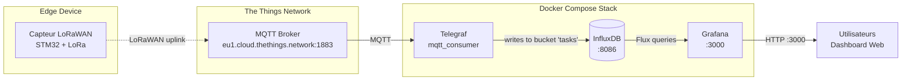
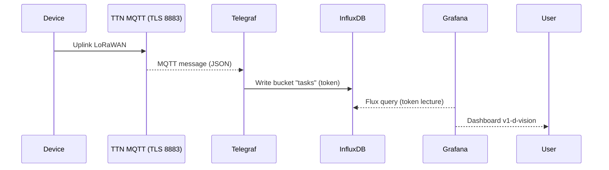

# vision-V1-D

## Aperçu rapide
- Stack de supervision IoT légère pour la vision V1-D.
- Collecte via Telegraf, stockage InfluxDB, visualisation Grafana, orchestration Docker Compose.

## Schéma d'infra

## Pourquoi ces outils ?
- Docker Compose : déploiement reproductible multi-services, isolations simples, portabilité.
- Telegraf : agent léger, plugins variés (input vision/système), configuration unique en TOML.
- InfluxDB : base time-series performante, TTL et rétentions faciles, requêtes Flux/InfluxQL.
- Grafana : dashboards rapides, alerting intégré, provisioning code (datasources/dashboards).

## Démarrage succinct
1) Prérequis : Docker + Docker Compose installés.
2) Lancer : `docker-compose up -d` depuis la racine.
3) Grafana : http://localhost:3000 (admin/admin par défaut si non changé).
4) Telegraf : `docker exec -it v1d-telegraf telegraf --once` pour vérifier la collecte.
5) Données : InfluxDB accessible sur 8086 (voir creds dans docker-compose ou secrets locaux).

## Diagramme de séquence (flux nominal)

